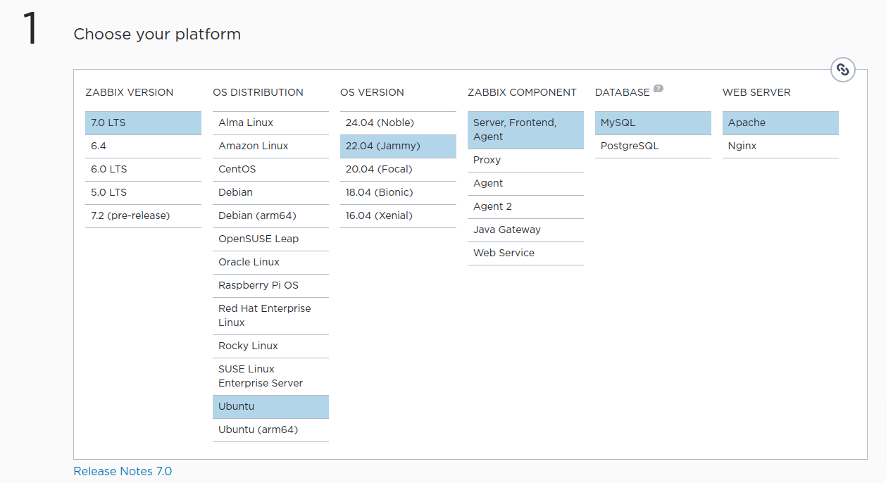
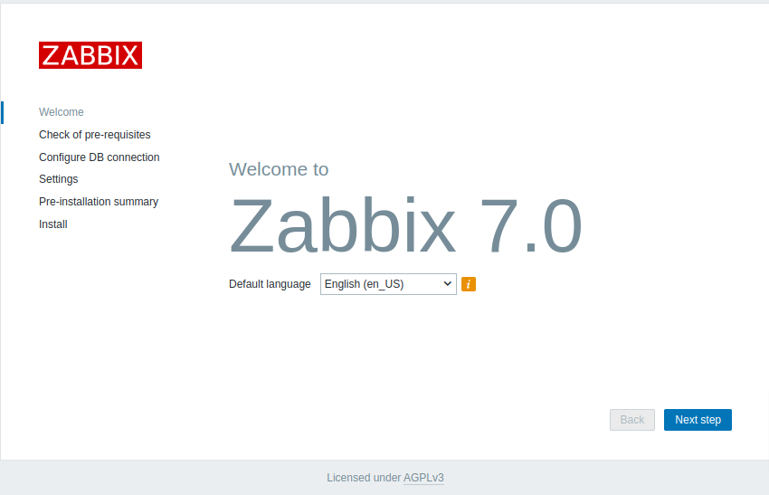
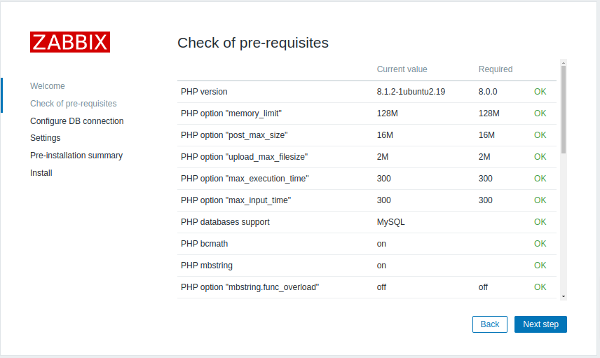
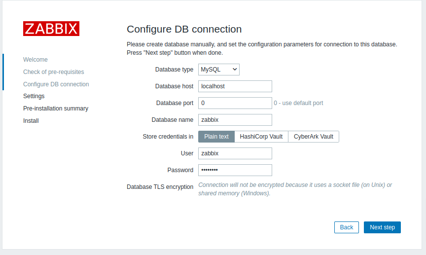
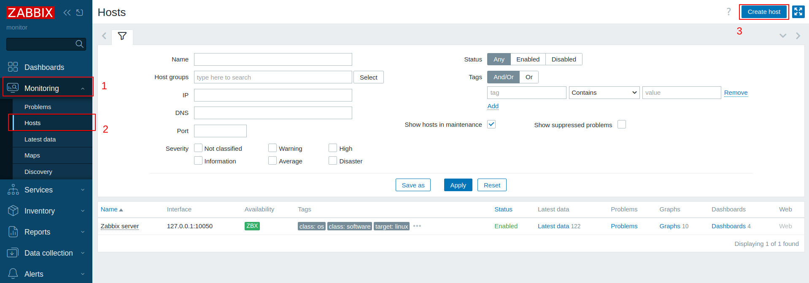
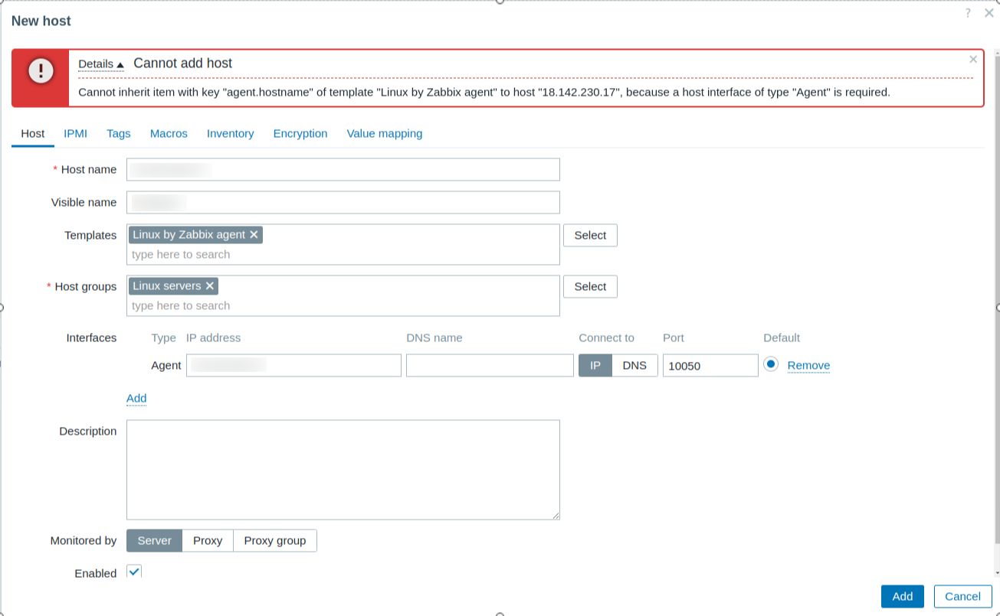

# Creating Monitoring Tools

##### 01. Create EC2

##### 02. Install Zabbix


```bash
sudo apt update
sudo -s
wget https://repo.zabbix.com/zabbix/7.0/ubuntu/pool/main/z/zabbix-release/zabbix-release_latest+ubuntu22.04_all.deb
dpkg -i zabbix-release_latest+ubuntu22.04_all.deb
apt update

apt install zabbix-server-mysql zabbix-frontend-php zabbix-nginx-conf zabbix-sql-scripts zabbix-agent

apt install mariadb-server 
mysql -uroot -p
Enter password: password
MariaDB [(none)]> create database zabbix character set utf8mb4 collate utf8mb4_bin;
MariaDB [(none)]> create user zabbix@localhost identified by 'password';
MariaDB [(none)]> grant all privileges on zabbix.* to zabbix@localhost;
MariaDB [(none)]> set global log_bin_trust_function_creators = 1;
MariaDB [(none)]> quit;

zcat /usr/share/zabbix-sql-scripts/mysql/server.sql.gz | mysql --default-character-set=utf8mb4 -uzabbix -p zabbix
Enter password: password

mysql -uroot -p
Enter password: password
MariaDB [(none)]> set global log_bin_trust_function_creators = 0;
MariaDB [(none)]> quit;

vim /etc/zabbix/zabbix_server.conf
DBPassword=password

vim /etc/zabbix/nginx.conf
listen 8080;
server_name example.com;

systemctl restart zabbix-server zabbix-agent nginx php8.1-fpm
systemctl enable zabbix-server zabbix-agent nginx php8.1-fpm
```
 <br>
 <br>
 <br>

```bash
http://your_ip/zabbix 
Login with default password " admin:zabbix"
```

 <br>


##### 03. Install Zabbix Agent
```bash
sudo su
wget https://repo.zabbix.com/zabbix/7.0/ubuntu/pool/main/z/zabbix-release/zabbix-release_latest+ubuntu20.04_all.deb
dpkg -i zabbix-release_latest+ubuntu20.04_all.deb
apt update

apt install zabbix-agent

sudo vim /etc/zabbix/zabbix_agentd.conf
Server=Zabbix-server-ip

systemctl restart zabbix-agent
systemctl enable zabbix-agent
```



