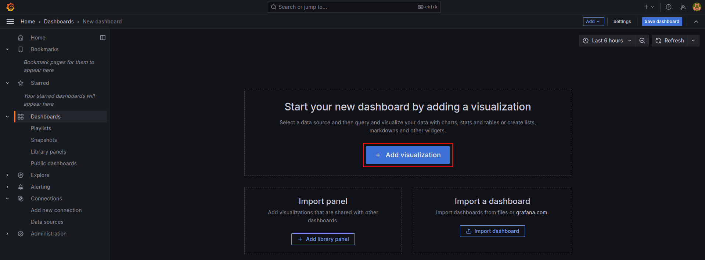

<h1 style="text-align:center;">Prometheus</h1>

#### Install docker
```bash
sudo apt update
sudo apt install docker.io
sudo groupadd docker
sudo usermod -aG docker $USER
logout

Note: Enter your server again and check your docker command without sudo

docker ps
```

#### Create docker network
```bash
docker network create lab-network
```
#### Run Grafana container
```bash
docker run -d --name=grafana -p 3000:3000 grafana/grafana
```
#### Setup node-exporter
```bash
docker run -d --name=node-exporter --net="host" prom/node-exporter
```
#### Install Business logic (from KT)
```bash
mkdir app && cd app
wget https://raw.githubusercontent.com/devktops/devops-misc/refs/heads/master/monitoring/app/Dockerfile
wget https://raw.githubusercontent.com/devktops/devops-misc/refs/heads/master/monitoring/app/app.py
```
#### Bulid Application
```bash
docker build -t lab-app .
```
#### Run Application on Docker
```bash
docker run --network lab-network -p 8000:8000 -d lab-app
```
#### Create Prometheus yml
```bash
mkdir prometheus && cd prometheus && vim prometheus.yml
```

##### Note: Add Below Script
```bash
global:
  scrape_interval: 5s  # Set the interval to scrape targets

scrape_configs:
  - job_name: 'python_app'
    static_configs:
      - targets: ['47.129.101.238:8000']  # Adjust to match the Python app’s metrics endpoint
  - job_name: 'node_exporter'
    static_configs:
      - targets: ['47.129.101.238:9100']
```

#### Run Prometheus Container
```bash
docker run -d --name prometheus --network lab-network -p 9090:9090 -v $(pwd)/prometheus.yml:/etc/prometheus/prometheus.yml prom/prometheus
```
##### Note: Call your_server_ip:9090 for Prometheus
##### Note: call your_server_ip:3000 for grafana
#### Add Prometheus to Grafana 


#### Add Dashborad




#### Import Dashboard


