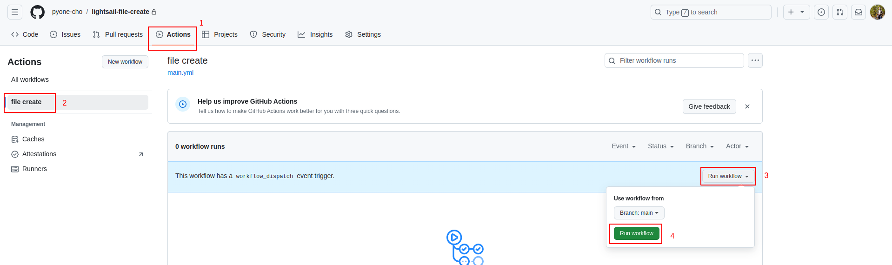

# Create file with github action to AWS Lightsail

#### 01. Create Private Repo (Name = lightsail-file-create)

#### 02. Create Lightsail

#### 03. Add SSHkey in github


<br>


#### 04. Add github action


<br>


<br>


```bash
name: file create
on:
  workflow_dispatch:
jobs:
  file_create:
    runs-on: ubuntu-latest
    steps:
      - name: create hello.txt
        uses: appleboy/ssh-action@v1.1.0
        with:
          host: ${{ secrets.HOST }}
          username: ${{ secrets.USERNAME }}
          key: ${{ secrets.KEY }}
          script: |
            echo "Hello World" > helloworld.txt
```

#### 04. Run Github Action


#### Ref: link
01. [appleboy/ssh-action](https://github.com/appleboy/ssh-action)