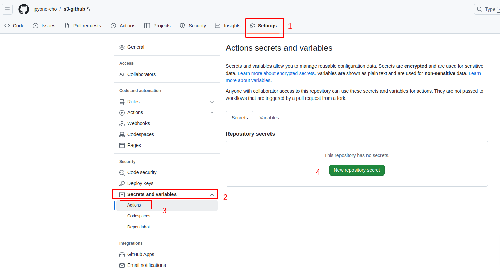
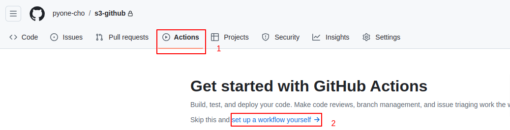
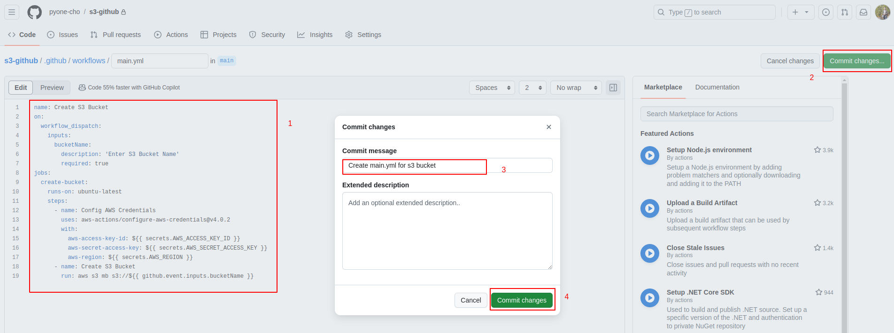
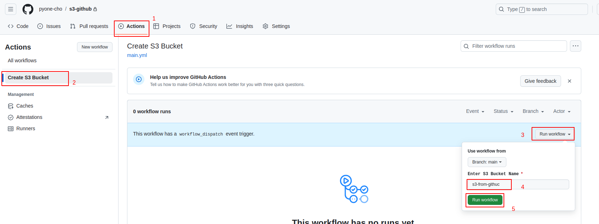

# Create S3 Bucket with github action

#### 01. Create Private Repo (Name = s3-create)

#### 02. Create IAM User
         Create access key for s3 full access

#### 03. Add AWS access and secret key in github
```bash
Name: AWS_ACCESS_KEY_ID
Key:
Name: AWS_SECRET_ACCESS_KEY
Key:
Name: AWS_REGION
Key: ap-southeast-1
```


<br>

#### 04. Add github action


<br>


<br>

```bash
name: Create S3 Bucket 
on: 
  workflow_dispatch: 
    inputs: 
      bucketName: 
        description: 'Enter S3 Bucket Name' 
        required: true 
jobs: 
  create-bucket: 
    runs-on: ubuntu-latest 
    steps: 
      - name: Config AWS Credentials 
        uses: aws-actions/configure-aws-credentials@v4.0.2
        with: 
          aws-access-key-id: ${{ secrets.AWS_ACCESS_KEY_ID }} 
          aws-secret-access-key: ${{ secrets.AWS_SECRET_ACCESS_KEY }}
          aws-region: ${{ secrets.AWS_REGION }} 
      - name: Create S3 Bucket 
        run: aws s3 mb s3://${{ github.event.inputs.bucketName }} 
```

#### 04. Run Github Action
